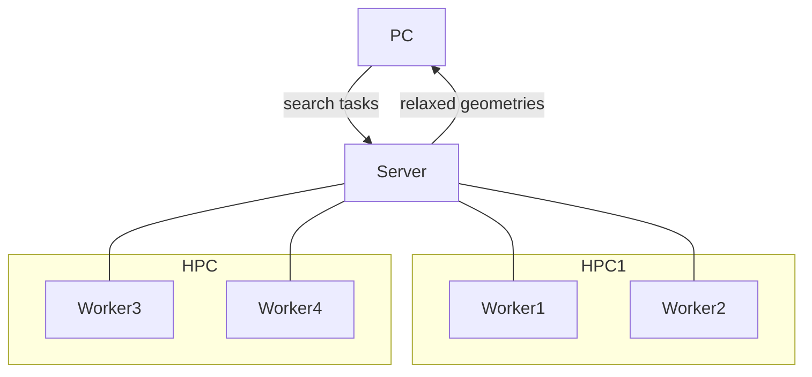

# DISP (Distributed Structure Prediction)


Documentation: https://zhubonan.github.io/disp/

This package is for distributing the workload of *ab initio* random structure searching ([AIRSS](https://www.mtg.msm.cam.ac.uk/Codes/AIRSS)) over flexible computing resources.
With AIRSS, random yet physically sensible candidate crystal structures are generated and subsequently relaxed.
The search is inherently parallel and fast time-to-solution can be achieved by simultaneously running many "small" (a few tens of cores) DFT calculations in a highly efficient way.

In practice, the computing resources can be scattered spatially and temporally - there might be multiple machines that the search can run on, the each job may have to queue and subsequently run for only a limited amount of time.

DISP makes searching easier by providing a centralised server that handles distributing and controlling each search *worker*, getting real-time analytics data, as well as keeping a database of relaxed structures.
It is built upon the original AIRSS package and is fully compatible with the latter.


## Installation

A newer version of `pip` ( `>21`) might be needed - upgrade with:

```
pip install -U pip
```

install the package with:

``` none
pip install git+https://https://github.com/zhubonan/disp
```

## Requirements

- A MongoDB server is needed to act as the centralised workflow controller and a place to store search results.
- DISP and its python dependencies needs to be installed on both the local computer and the remote computing cluster/super computer, together with [AIRSS](https://www.mtg.msm.cam.ac.uk/Codes/AIRSS).
- Behind the scene, an extended version [fireworks](https://github.com/materialsproject/fireworks) is used for workflow management, it should be installed automatically with DISP.
- The plane wave DFT code [CASTEP](http://www.castep.org) is used for searching, although support for other code can be added if needed.
- Scheduler supported is limited to SGE and SLURM at the moment, but others can be added, given that job information is available at the run time.

## Usage

Usage is focused on command line, although python interface is also provided for analytics.

Deploy search with:

```
disp deploy search
```

Summary of throughput:

```
disp db throughput
```

Summary of finished/waiting jobs:

```
disp db summary
```

Pull completed search on to the disk:

```
disp db retrieve-project
```


## Other resources

- AIRSS code: https://www.mtg.msm.cam.ac.uk/Codes/AIRSS
- Documentation for AIRSS: https://airss-docs.github.io/
- metador - high throughput CASTEP geometry optimisation and analysis: https://github.com/ml-evs/matador
- aiida-fireworks-scheduler - for running standard AiiDA workflow alongside structure prediction workload from this package : https://github.com/zhubonan/aiida-fireworks-scheduler

## Reference

- Pickard, C. J.; Needs, R. J. High-Pressure Phases of Silane. Phys. Rev. Lett. 2006, 97 (4), 045504. https://doi.org/10.1103/PhysRevLett.97.045504.
- Pickard, C. J.; Needs, R. J. Ab Initio Random Structure Searching. Journal of physics. Condensed matter : an Institute of Physics journal 2011, 23 (5), 053201–053201. https://doi.org/10.1088/0953-8984/23/5/053201.
