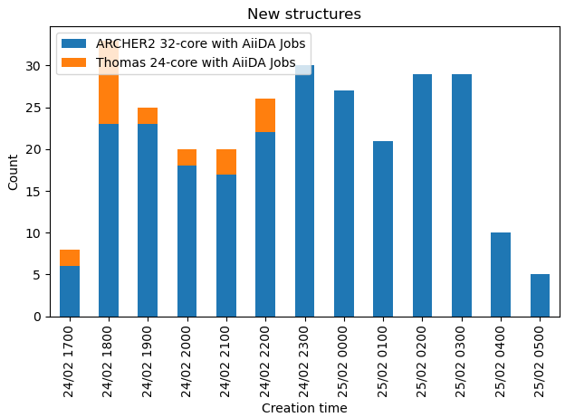

# Manage the search

## Monitor throughput

The easiest way to see how the search is going is to use the `disp db throughput` command.
It will show a bar chart of the number of new structure per hour, and it is possible to controll what the counts are grouped with

```
disp db throughput  -g worker_name
```

{: style="width:450px"}

## Check progress

Use `disp db summary --project <project_name>` to check how many structure has been relaxed for the particular project(s).
The `<project_name>` field is an regular expression to be used for matching.
It is also possible to use `--seed` to further select certain seed names.

In addition, to the number of structure generated, it will also show how many workflows for each seed has been completed or ready to run.

???+ example

    ```
    $ disp db summary --project LFP
                                                Structure       WF count - search
                                                RES  Init          ARCHIVED DEFUSED FIZZLED     ALL
    project                     seed
    catdisc/LFP/with-u-rerun    2LFP              663   816             792.0     1.0     7.0   800.0
                                4LFP              972  1200            1200.0     0.0     0.0  1200.0
    catdisc/LFP/without-u-rerun 2LFP              762   800             800.0     0.0     0.0   800.0
                                4LFP             1157  1200            1200.0     0.0     0.0  1200.0

    ```
    Or per project statistics.

    ```
    $ disp db summary --project LFP --per-project
                            Structure       WF count - search
                                    RES  Init          ARCHIVED DEFUSED FIZZLED     ALL
    project
    catdisc/LFP/with-u-rerun         2383  2995            2936.0  1001.0    63.0  4000.0
    catdisc/LFP/without-u-rerun      2838  3117            2977.0  1000.0    23.0  4000.0
    ```

## Prioritize certain tasks

Priority of the tasks (`Firework`) can be modified with `lpad` interface.
The following command can be used to change the priority of project `catdisc/LFP`.

```
lpad updates_fws -q '{"spec.project_name": "catdisc/LFP", "state":"READY"} -u '{"_priority": 100}'
```

!!! note

    Unfinished relaxations (e.g. restarts) will have increase priority over new structures.

## Cancel searches

A search can be cancelled/paused by defuse/pause relavant tasks.
This may be achieved with the `lpad` interface.

```
lpad defuse_fws -q '{"spec.project_name": "catdisc/LFP", "state":"READY"}
```

and

```
lpad pause_fws -q '{"spec.project_name": "catdisc/LFP", "state":"READY"}
```

for pausing jobs.

!!! note

    Due to the limitation of fireworks, pausing/defusing a large number of jobs can take a long time and no progress is reported.
    A modified version of `fireworks` can be used to include process report ([here](https://github.com/zhubonan/fireworks/tree/bz-changes)).


## Failure handling/lost runs

CASTEP relaxations are usually fairly robust and you should not see consistent DFT errors.
Due to the nature of the random structure, it is not rare that certain relaxation would errors.
Since it is *random* sampling, having *randomly* failed calculation should not affect the results.

However, in some cases, especially systems with spin-polarisation and requires Hubbard U correction, CASTEP may struggle to converge the electronic structure for ill-form input structures.
You will see that the number of relaxed structure being much fewer than that of the initial structures, despite relaxation workflow being in the "COMPLETED" states, which is for the purpose of workflow management only.

To access the actual relaxation output, one has to dig into the *stored_data* of the associated *launch*,
then check the launch directory of those in the `ERRORED` state.

## Lost runs

Due to the server-client architecture of the workflow system. The client may lose content with the server, causing the jobs checked out to be staled.
This is, unfortunately, irrecoverable, and the only solution is to *rerun* the lost task.

This can be done with:

```
lpad detect_lostruns --rerun
```

since the necessary information to start a new CASTEP calculation is already stored on the server.
