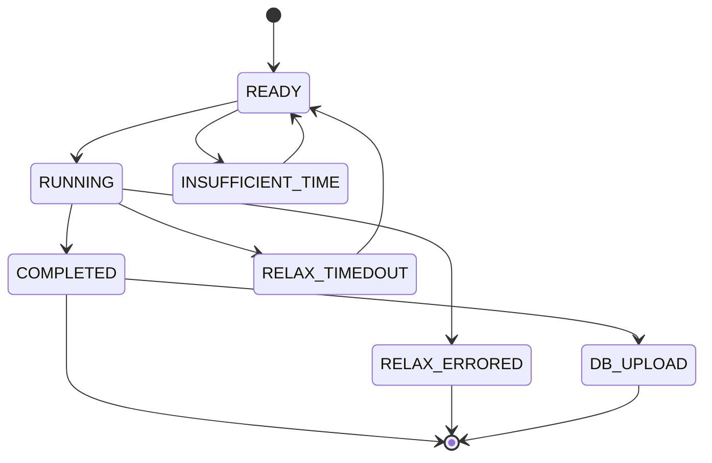

# Inner workings

## Fireworks

[Fireworks](https://github.com/materialsproject/fireworks) is the
workflow engine that DISP uses to deploy searches. Its fully
documentation can be found in its own website. For simple search and
retrieve type of work, knowing how to work with fireworks is not
required. However, detailed analytics and updating existing search jobs
requires using the `lpad` command line interface, or the
`LaunchPad` python interface of fireworks.

## MongoDB

MongoDB is a NSQL database that
[fireworks](https://github.com/materialsproject/fireworks) uses as a
centralised server that each *worker* pulls jobs from. DISP also uses
MongoDB to store relaxed geometry generated by the search. Knowledge of
MongoDB is required for advanced usages.

The quickest way to launch an MongoDB server on your own computer is to
launch it throgh [docker](https://www.docker.com/). Free public internet
server is avaliable from the [MongoDB
Atlas](https://www.mongodb.com/atlas/database/) service. However, the
free tier impose many limitations, and you may want to run a virtual
private server (VPS) for MongoDB service yourselves.

## Life cycles of a search task

