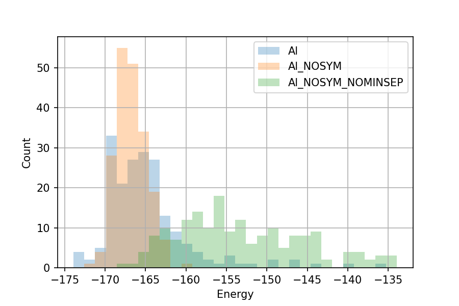

# Lennard-Jones 38 cluster


In this example we search for a LJ 38 cluster and compare the effect of symmetry and minimum species-wise separation.

The baseline seed is shown below. Where atoms are placed in a sphere of 3.75 A with a minimum separation of 1.5 A.

!!! example "Al.cell"

    ```
    %BLOCK LATTICE_CART
    20 0 0
    0 20 0
    0 0 20
    #FIX
    %ENDBLOCK LATTICE_CART

    %BLOCK POSITIONS_FRAC
    Al 0.0 0.0 0.0 # Al1 % NUM=38
    %ENDBLOCK POSITIONS_FRAC

    FIX_ALL_CELL : true

    #MINSEP=1.5
    #CLUSTER
    #POSAMP=3.75
    #SYMMOPS=2-5
    #NFORM=1
    ```

???+ example "Al.pp"

    ```
    1 12 6 2.5
    Al
    # Epsilon
    1
    # Sigma
    2
    # Beta
    1
    ```

Two more seeds are included, with one not using any symmetry, and the other also have minimum separation disabled


??? example "Al_NOSYM.cell"

    ```
    %BLOCK LATTICE_CART
    20 0 0
    0 20 0
    0 0 20
    #FIX
    %ENDBLOCK LATTICE_CART

    %BLOCK POSITIONS_FRAC
    Al 0.0 0.0 0.0 # Al1 % NUM=38
    %ENDBLOCK POSITIONS_FRAC

    FIX_ALL_CELL : true

    #MINSEP=1.5
    #CLUSTER
    #POSAMP=3.75
    ##SYMMOPS=2-5
    #NFORM=1
    ```

??? example "Al_NOSYM_NOMINSEP.cell"

    ```
    %BLOCK LATTICE_CART
    20 0 0
    0 20 0
    0 0 20
    #FIX
    %ENDBLOCK LATTICE_CART

    %BLOCK POSITIONS_FRAC
    Al 0.0 0.0 0.0 # Al1 % NUM=38
    %ENDBLOCK POSITIONS_FRAC

    FIX_ALL_CELL : true

    ##MINSEP=1.5
    #CLUSTER
    #POSAMP=3.75
    ##SYMMOPS=2-5
    #NFORM=1
    ```

Deploy three search runs to the server.

```
disp deploy search --seed Al --project example/1.04 --num 200 --code pp3 --cluster
disp deploy search --seed Al_NOSYM --project example/1.04 --num 200 --code pp3 --cluster
disp deploy search --seed Al_NOSYM_NOMINSEP --project example/1.04 --num 200 --code pp3 --cluster
```

Now run the search with:

```
export DISP_DB_FILE=`pwd`/disp_db.yaml
rlaunch multi 4 --local_redirect
```

There will be many `launch*` sub directories got created, which can be deleted.

!!! note

    If you don't have a `FW_CONFIG_FILE` environmental varible set, search result will also be copied to `$USER/disp-base/airss-datastore/example/1.04`.


```
$ disp db summary --project example/1.04
                               Structure      WF count - search
                                     RES Init         COMPLETED  ALL
project      seed
example/1.04 Al                      200  200               200  200
             Al_NOSYM                200  200               200  200
             Al_NOSYM_NOMINSEP       200  200               200  200
```

To retrieve the SHELX files:


```
disp db retrieve-project --project example/1.04
```

Standard AIRSS toolkits can be used to rank the structures:

```
$ ca -u 0.01 -s -cl -r -t

Al-22022*08-4d246b      -173.912   38 Al           Oh         2   582      ~
Number of structures   :    582
Number of compositions :      1
Al-22022*08-4d246b       0.00   210.526      -4.577  38 Al           Oh         2
Al-22022*05-910e48       0.00   210.526       0.018  38 Al           C5         1
Al-22022*03-db3120       0.00   210.526       0.026  38 Al           C5         1
Al_NOSYM*36-414ffd       0.00   210.526       0.047  38 Al           C1         1
Al-22022*57-e24a2b       0.00   210.526       0.051  38 Al           Cs         1
Al-22022*56-66b471       0.00   210.526       0.066  38 Al           Cs         1
Al_NOSYM*14-999f3c       0.00   210.526       0.077  38 Al           C1         1
Al-22022*54-625f07       0.00   210.526       0.078  38 Al           D4h        1
Al_NOSYM*36-30e049       0.00   210.526       0.085  38 Al           C1         1
Al-22022*53-a81769       0.00   210.526       0.091  38 Al           C2         1
```

## Using DISP python interface for analysis


SHELX entries stored in DISP can be pulled and analysed.
The python code below generates histograms of the energy distribution from these three different seeds.


```python
from disp.database.api import SearchDB
from disp.analysis.airssutils import ResFile, collect_results_in_df

sdb = SearchDB.from_db_file("disp_db.yaml")

df = collect_results_in_df(project_name='example/1.04')
yrange = (df.enthalpy.min(), df.enthalpy.min() + 40)

for key, sub in df.groupby('seed_name'):
    sub.enthalpy.hist(range=yrange, bins=30, alpha=0.3, label=key)
plt.legend()
plt.xlabel('Energy')
plt.ylabel('Count')
plt.savefig('disp-lj38.png', dpi=150)
```

Output plot:

{: style="width:450px"}

It can be seen that the symmetry and minimum separations constraints have great impact on the distribution of the relaxed structure.
The ground state structure with $O_h$ point group symmetry can be found easily with 200 trials, but it can be a lot most difficult to obtain by a naive random placement of atoms inside a sphere.
