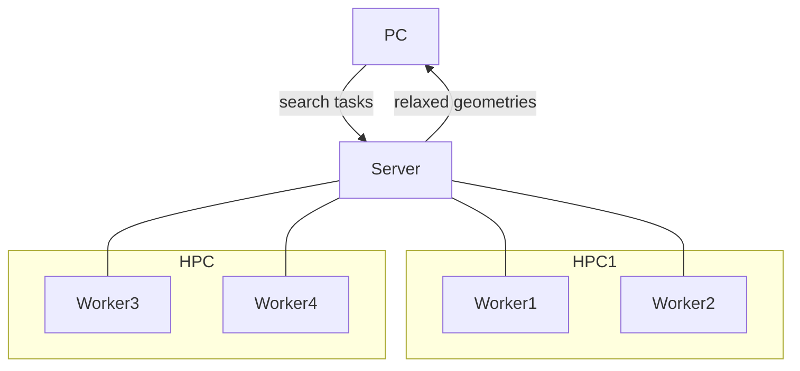

# Welcome to DISP's documentation

DIstributed Structure Prediction (DISP) is a package for running crystal
structure prediction workloads in a distributed and asynchronous manner
over a range of computing resources. At the moment, it is mainly for
managing and running *ab initio* random structure searching
([AIRSS](https://www.mtg.msm.cam.ac.uk/Codes/AIRSS)).

The main advantage of using this package of over the transitional way of
submitting many arrays jobs for individual seeds is that each search can
span over multiple computing clusters, and the jobs resources are
allocated dynamically at *run time*, rather than fixed at *submission*
time. For example, it is possible to queue up many searching workloads
or divert all computing power to a specific problem on-demand.

Behind the scene, this packages uses
[fireworks](https://materialsproject.github.io/fireworks/) as the
backend for job scheduling. This also means that the structure
prediction workload can be run together with other jobs such as those
managed by [AiiDA](https://www.aiida.net/) and
[automate](https://atomate.org/). The search results are centrally
stored in a MongoDB server, which allows statistics from multiple
originals to be combined easily for analysis. The main way of
interacting with DISP is through a command line interface (CLI). The
packaged is aimed to be fully compatible with the toolkit provided by
the original open sourced (GPLv2) AIRSS toolkit.

The plane-wave DFT code [CASTEP](http://www.castep.org) is recommended for
running the search due to its robustness electronic solver and reliable
local optimisation routines. Typically, the search is done with
calculations optimised for speed rather than accuracy (convergence), and
addition calculations (refinement) will need to be run on a small set of
low energy structures. DISP also supports directly launching these
workloads using CASTEP and VASP (through [automate](https://github.com/hackingmaterials/atomate)).
